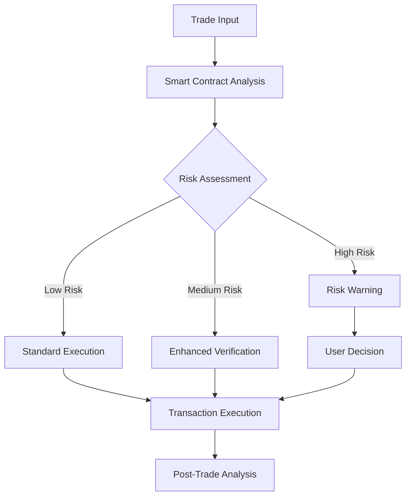

## Institutional Grade Trade Desk

Zereus is a comprehensive trading infrastructure, unifying cross-chain operations, portfolio management, and execution optimization into a seamless platform.

<CardGroup cols={3}>
  <Card title="Trade Desk" icon="chart-line" color="#8A2BE2">
    Advanced trading interface with cross-chain execution, optimized routing, and MEV protection
  </Card>

  <Card title="Portfolio Manager" icon="folder-tree" color="#8A2BE2">
    Unified multi-chain portfolio tracking, analytics, and performance monitoring
  </Card>

  <Card title="Risk Guardian" icon="shield-halved" color="#8A2BE2">
    Smart contract analysis, transaction security, and position risk management with real time updates
  </Card>
</CardGroup>

## Core Components

### Trade Desk

The nerve center of your trading operations, handling everything from execution to optimization.

  

    <h3 className="text-xl font-bold mb-4">Cross-Chain Execution</h3>

    <ul className="list-disc pl-4 space-y-2 text-gray-300">
      <li>Execute trades across multiple blockchains with one click</li>
      <li>Automatic bridging between networks</li>
      <li>Support for ETH, SOL, MATIC, BNB, and more chains</li>
      <li>Single transaction for multi-step operations</li>
    </ul>
  

  

    <h3 className="text-xl font-bold mb-4">Smart Routing</h3>

    <ul className="list-disc pl-4 space-y-2 text-gray-300">
      <li>Query 70+ liquidity sources simultaneously</li>
      <li>Optimize for fees, slippage, or execution speed</li>
      <li>Split orders across multiple paths for better execution</li>
      <li>Dynamic re-routing based on real-time conditions</li>
    </ul>
  

  

    <h3 className="text-xl font-bold mb-4">Advanced Order Types</h3>

    <ul className="list-disc pl-4 space-y-2 text-gray-300">
      <li>Limit orders across any chain</li>
      <li>Stop-loss protection</li>
      <li>Take-profit automation</li>
      <li>Dollar-cost averaging</li>
      <li>Time-weighted average price (TWAP)</li>
    </ul>
  

  

    <h3 className="text-xl font-bold mb-4">Security Suite</h3>

    <ul className="list-disc pl-4 space-y-2 text-gray-300">
      <li>MEV protection against front-running</li>
      <li>Sandwich attack defense</li>
      <li>Slippage control mechanisms</li>
      <li>Transaction simulation before execution</li>
      <li>Smart contract risk assessment</li>
    </ul>
  

### Portfolio Manager

Gain complete visibility and control over your assets across the entire crypto ecosystem.

<Accordion title="Multi-Chain Portfolio Tracking">
  The Portfolio Manager automatically aggregates all your holdings across connected wallets, providing:

  * **Unified Dashboard**: View all assets across multiple chains in one interface

  * **Performance Analytics**: Track historical performance with detailed metrics

  * **Real-Time Valuation**: Up-to-the-minute portfolio valuation

  * **Allocation Visualization**: Visual breakdown of asset distribution

  * **Chain Distribution**: Understand your exposure across different networks
</Accordion>

<Accordion title="Performance Analytics">
  Comprehensive analytics to optimize your trading strategy:

  * **Historical Returns**: Track performance across different time periods

  * **Attribution Analysis**: Understand which trades contributed most to performance

  * **Risk Metrics**: Analyze volatility, drawdowns, and risk factors

  * **Benchmark Comparison**: Compare performance against market indices

  * **Profit/Loss Reporting**: Detailed P\&L statements for accounting
</Accordion>

<Accordion title="Tax & Reporting">
  Simplify the complex world of crypto taxes and reporting:

  * **Transaction History**: Complete record of all trades across chains

  * **Export Capabilities**: Generate reports compatible with tax software

  * **Cost Basis Tracking**: Automatically calculate cost basis for positions

  * **Realized/Unrealized Gains**: Clear distinction between realized and paper gains

  * **Annual Summaries**: Year-end reports for tax preparation
</Accordion>

### Risk Guardian

Protect your assets and optimize risk management across your portfolio.

<Accordion title="Smart Contract Security">
  Automated analysis of token smart contracts before you trade:

  * **Code Verification**: Check contract code against known vulnerabilities

  * **Rugpull Detection**: Identify suspicious contract patterns

  * **Developer Analysis**: Assess team history and previous projects

  * **Liquidity Assessment**: Evaluate liquidity depth and stability

  * **Risk Scoring**: Generate a comprehensive risk score for tokens
</Accordion>

<Accordion title="Position Risk Management">
  Tools to manage downside protection and portfolio risk:

  * **Automated Stop-Loss**: Set chain-agnostic stop losses for any position

  * **Trailing Stops**: Protect gains with dynamic trailing stop orders

  * **Exposure Alerts**: Notifications when concentration risk exceeds thresholds

  * **Volatility Monitoring**: Track volatility spikes that may signal increased risk

  * **Correlation Analysis**: Understand how your assets move together
</Accordion>

## Integration with Intelligence Layer

While powerful on its own, the Execution Layer unlocks its full potential when combined with zAI intelligence:

  

    
🔍

    <h3 className="font-bold mb-2">Discovery</h3>
    
zAI identifies emerging opportunities across the market

  

  

    
⚡

    <h3 className="font-bold mb-2">Execution</h3>
    
Trade Desk enables instant position taking across any chain

  

  

    
📊

    <h3 className="font-bold mb-2">Management</h3>
    
Portfolio Manager tracks performance and optimizes positions

  

## Platform Fee Structure

Zereus operates on a simple fee structure for all trading activities:

<Card title="Base Trading Fee">
  * **1%** per trade on every buy/sell

  * Fees are automatically calculated and deducted

  * Volume-based discounts available for high-volume traders
</Card>

## Subscription Tiers

<CardGroup cols={3}>
  <Card title="GENESIS" icon="seedling" color="#8A2BE2">
    ### Free + Base Trading Fee

    **Trade Desk**

    * Cross-chain execution

    * Basic routing

    * CA Security

    **Portfolio Manager**

    * Basic tracking

    * Position monitoring
  </Card>

  <Card title="ODYSSEY" icon="rocket" color="#8A2BE2">
    ### $599/month

    **Everything in GENESIS plus:**

    * Advanced order types

    * Enhanced routing

    * MEV protection

    * Performance analytics

    * Tax reporting
  </Card>

  <Card title="APEX" icon="crown" color="#8A2BE2">
    ### $1199/month

    **Everything in ODYSSEY plus:**

    * Institutional-grade execution

    * Priority routing

    * Custom risk parameters

    * API access

    * Dedicated support
  </Card>
</CardGroup>

<Card title="The Complete Trading Solution" icon="bolt" color="#8A2BE2">
  From intelligence to execution to management, Zereus provides the complete infrastructure for modern crypto trading.

  [Explore the Intelligence Layer →](/defai/intelligence-layer)
</Card>