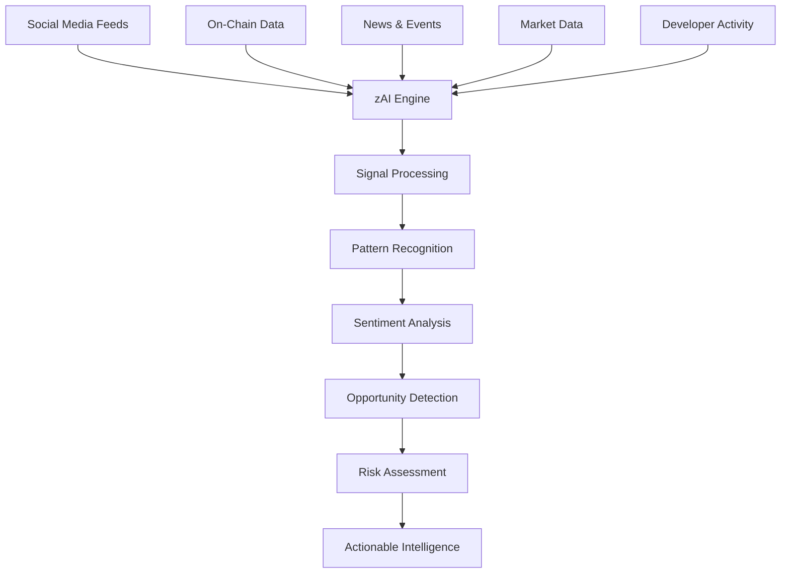

# zAI Intelligence Layer

<Note>
  **Trading is 90% information and 10% action**. In crypto, the difference between success and failure often comes down to who has the information first.
</Note>

Over the year we have built out a custom AI model and in-house agent stack that can detect, summarise & interlink the dots.&#x20;

## The Information Edge

In the hyper-connected world of crypto, critical signals exist everywhere:

* A whale wallet suddenly becomes active after months

* A developer commits code at 3 AM before a major announcement

* Community sentiment shifts right before a market move

* An influential voice posts an obscure reference to a project

Most traders miss these signals. **With zAI, you won't.**

## What Makes zAI Different

<CardGroup cols={2}>
  <Card title="10,000+ Data Sources" icon="satellite-dish" color="#8A2BE2">
    While others track a few dozen influencers, zAI processes data from over 10,000 sources across social media, GitHub, blockchain explorers, and private communities.
  </Card>

  <Card title="Predictive, Not Reactive" icon="crystal-ball" color="#8A2BE2">
    Standard tools tell you what's happening now. zAI predicts what's about to happen by detecting subtle pattern changes across multiple data dimensions.
  </Card>

  <Card title="Context-Aware Analysis" icon="brain-circuit" color="#8A2BE2">
    zAI understands crypto-specific language, memes, and sentiment, distinguishing between genuine signals and market noise with remarkable accuracy.
  </Card>

  <Card title="Narrative Detection" icon="binoculars" color="#8A2BE2">
    Identify emerging market narratives in their earliest stages, when potential returns are highest and competition is lowest.
  </Card>
</CardGroup>

## Inside the zAI Engine

## zAI Modules: From Data to Alpha

### Narrative Sniper

> "We first detected & signalled $TRUMP at 420M market cap, by the time markets got a wind of what's happening it was already trading at $5."

Narrative Sniper doesn't just track tweets — it understands them. The system analyzes:

* Context and subtext of crypto discussions

* Historical impact of specific accounts

* Unusual engagement patterns

* Network connections between influencers

**ODYSSEY users** track 250 accounts in real-time.
**APEX users** get unlimited monitoring across Twitter, Telegram, and Discord.

### Alpha Discovery

Alpha Discovery uses multi-dimensional analysis to identify high-conviction trading opportunities:

<table>
  <thead>
    <tr>
      <th>Signal Type</th>
      <th>What zAI Detects</th>
      <th>Why It Matters</th>
    </tr>
  </thead>

  <tbody>
    <tr>
      <td>Whale Movements</td>
      <td>Large wallets accumulating specific tokens</td>
      <td>Often precedes major price movements</td>
    </tr>

    <tr>
      <td>Developer Activity</td>
      <td>Increased GitHub contributions to a project</td>
      <td>Indicates potential upcoming features/releases</td>
    </tr>

    <tr>
      <td>Sentiment Shifts</td>
      <td>Early changes in community sentiment</td>
      <td>Sentiment often precedes price action</td>
    </tr>

    <tr>
      <td>Narrative Emergence</td>
      <td>New themes gaining traction across platforms</td>
      <td>Sector-wide movements often begin with narrative shifts</td>
    </tr>
  </tbody>
</table>

### Token DNA Sequencer

For APEX subscribers, zAI provides unparalleled depth in token analysis:

<Accordion title="DNA Sequencing Process">
  1. **Contract Analysis**: Examines code quality, security vulnerabilities, and unique features

  2. **Tokenomics Assessment**: Evaluates supply mechanics, distribution, and economic design

  3. **Team Evaluation**: Analyzes team history, previous projects, and contribution patterns

  4. **Network Effects**: Measures community growth, engagement quality, and expansion rate

  5. **Market Fit**: Assesses how the project fits into emerging market narratives

  6. **Risk Profile**: Calculates a comprehensive risk score based on all factors
</Accordion>

## How zAI Credits Work

Think of zAI credits as computational power for your trading intelligence:

<CardGroup cols={3}>
  <Card title="ODYSSEY" icon="rocket" color="#8A2BE2">
    **1,000 Credits/Month**

    Base scan: 1 credit
    Detailed analysis: 5 credits
    Custom report: 10 credits
    Additional: $45/per 100 credit
  </Card>

  <Card title="APEX" icon="crown" color="#8A2BE2">
    **2,500 Credits/Month**

    Base scan: 1 credit
    Detailed analysis: 5 credits
    Custom report: 10 credits
    Additional: $30/per 100 credit
  </Card>

  <Card title="GENESIS" icon="seedling" color="#8A2BE2">
    **No Included Credits**

    zAI not included
    Can purchase credits
    $50/per 100 credit
  </Card>
</CardGroup>

<Card title="Experience the Information Edge" icon="lightbulb" color="#8A2BE2">
  Discover what you've been missing in the markets. No more FOMO, no more "how did I miss that?" – just clear, actionable intelligence when it matters most.

  [See How Execution Completes the Picture →](/defai/execution-layer)
</Card>