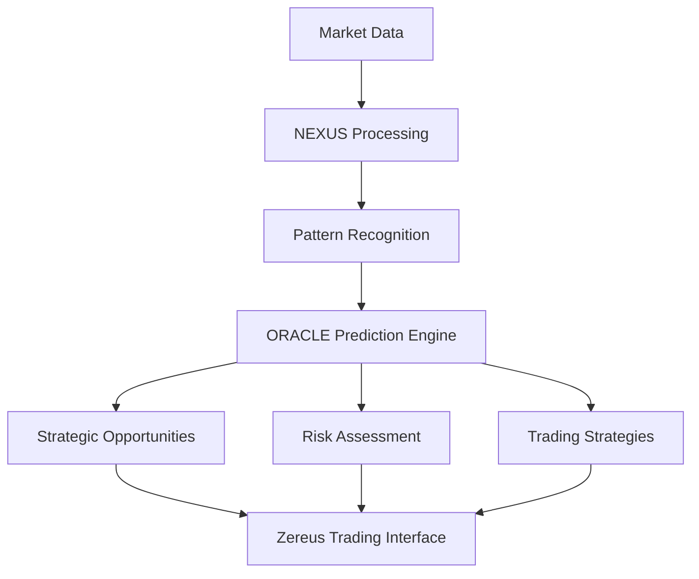

# Introduction to zAI

## The Intelligence Layer Between Onchain & Offchain

zAI (formerly ALINAintel) is the core intelligence engine that powers Zereus, the institutional-level trade desk for DeFi. Operating as a neural network for the market, zAI processes and analyzes thousands of signals that most traders miss until it's too late, helping you predict trends before they go mainstream.

<Note>
  **Stop reacting. Start predicting.**

  zAI turns information warfare into strategic advantage by bridging the gap between blockchain transparency and market-moving intelligence.
</Note>

## The Information Paradox

Despite blockchain's transparency, crucial market-moving information often resides in closed channels. The market doesn't announce itself. While signals are everywhere:

* Onchain movements

* Social chatter

* Macro & Micro events

* Developer activity

* Whale wallet movements

They're buried under noise. By the time you react, the move has already happened. zAI solves this paradox by monitoring, processing, and analyzing these signals in real-time, giving Zereus traders an institutional-grade edge.

## How Small Signals Create Massive Ripples

In the cryptocurrency marketplace:

<CardGroup cols={2}>
  <Card title="Influencer Impact" icon="bullhorn">
    An influential figure posts about a token → Price surges 30%
  </Card>

  <Card title="Regulatory Changes" icon="scale-balanced">
    Regulatory whispers about ETFs → Institutions quietly build positions
  </Card>

  <Card title="Whale Movements" icon="whale">
    A whale's wallet leaks → Traders rush to copy trade
  </Card>

  <Card title="Developer Activity" icon="code">
    Significant codebase commits → Early indicator of project momentum
  </Card>
</CardGroup>

The traders who catch patterns and signals early **DOMINATE**. zAI is designed to give Zereus users this exact advantage.

# Technical Framework

zAI's intelligence is powered by two core systems working in tandem:

## NEXUS: The Signal Processor

<Frame>
  
</Frame>

NEXUS is zAI's perceptive mind that processes market information with unparalleled precision:

* Ingests & processes up to 10,000 signals per minute

* Monitors social media, blockchain data, and market movements

* Implements advanced pattern recognition algorithms

* Tracks whale movements and institutional behavior

* Analyzes developer activity and project momentum

Powered by a finetuned LLM and advanced algorithms, NEXUS transforms raw data into structured intelligence that feeds into ORACLE.

## ORACLE: The Crystal Ball

ORACLE represents zAI's visionary component that predicts potential market movements:

Key capabilities include:

* War-room like market simulation

* Strategic opportunity identification

* Risk factor evaluation

* Multiple outcome pathway analysis

* Trading strategy generation

# Core Capabilities

## Pattern Recognition

zAI continuously monitors multiple dimensions of the market:

<Tabs>
  <Tab title="Social Sentiment">
    * Natural language processing of social media content

    * Influence-weighted opinion analysis

    * Sentiment shifts across platforms

    * Narrative formation tracking
  </Tab>

  <Tab title="Institutional Activity">
    * Fund flows and positions

    * Smart money tracking

    * OTC desk activity signals

    * Accumulation/distribution patterns
  </Tab>

  <Tab title="Onchain Activity">
    * Whale wallet tracking

    * Smart contract interactions

    * Token flow analysis

    * Liquidity movements
  </Tab>

  <Tab title="Market Correlations">
    * Cross-chain analytics

    * Asset correlation mapping

    * Market sector movements

    * Liquidity flow patterns
  </Tab>
</Tabs>

## Predictive Intelligence

zAI's predictive capabilities give Zereus traders a significant edge:

<AccordionGroup>
  <Accordion title="Market Movement Forecasting">
    Anticipate price action based on multi-dimensional analysis of market conditions, historical patterns, and current signals.
  </Accordion>

  <Accordion title="Trend Prediction">
    Identify emerging trends before they become obvious to the market, enabling early positioning in promising assets.
  </Accordion>

  <Accordion title="Risk Assessment">
    Evaluate potential risks including liquidity crises, rug pull indicators, smart contract vulnerabilities, and market manipulation attempts.
  </Accordion>

  <Accordion title="Opportunity Identification">
    Discover high-potential assets and optimal entry points across multiple timeframes and risk profiles.
  </Accordion>

  <Accordion title="Strategic Scenario Planning">
    Model multiple potential market outcomes and develop contingency strategies for various scenarios.
  </Accordion>
</AccordionGroup>

# zAI Integration in Zereus

Within the Zereus institutional trade desk, zAI powers several key modules:

## Degen Picks Module

The short-term opportunity identification system for traders seeking immediate action:

* Monitors newly launched tokens

* Tracks key metrics:

  * Creation time

  * Liquidity depth

  * Market capitalization

  * Transaction volume

  * Social engagement

* Provides risk assessment:

  * Contract audit status

  * Team verification

  * Liquidity lock validation

  * Trading pattern analysis

## Alpha Picks Module

Focused on high-potential tokens with proven growth trajectories:

* Analyzes established tokens for growth potential

* Monitors key indicators:

  * ATH gains

  * Market cap progression

  * Volume patterns

  * Social signals

  * Developer activity

* Provides trend analysis:

  * Support/resistance identification

  * Volume profile analysis

  * Market sentiment correlation

  * Institutional interest

## Market Intelligence Dashboard

A comprehensive visualization of market conditions:

<Frame>
  
</Frame>

* Real-time monitoring of:

  * Market sentiment indicators

  * Trending narratives

  * Social signal strength

  * Whale movement alerts

* Predictive indicators:

  * Trend reversal signals

  * Momentum indicators

  * Risk assessment metrics

  * Opportunity scores

## Interactive AI Interface

Zereus traders can interact directly with zAI through a natural language interface:

* Execute cross-chain transactions

* Analyze real-time market conditions

* Query specific tokens or market sectors

* Generate custom intelligence reports

* Receive strategic trading recommendations

# Governance and Verification

To ensure the highest standards of intelligence accuracy, zAI implementations include:

* Continuous model training and refinement

* Community-driven intelligence verification

* Expert validation of critical signals

* Feedback loops for improved accuracy

* Automated and manual quality controls

***

<Note>
  Ready to experience institutional-grade trading intelligence? [Get started with Zereus](/getting-started) to access the full power of zAI.
</Note>